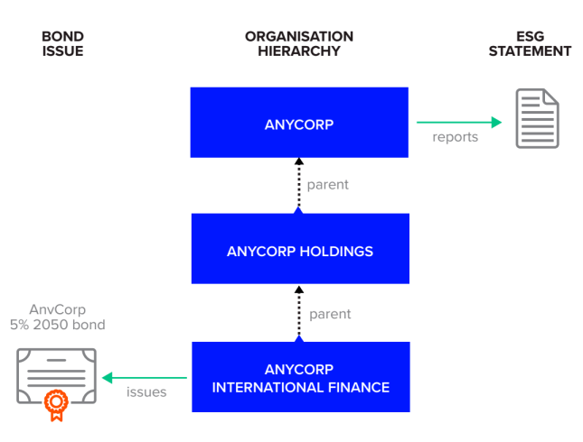
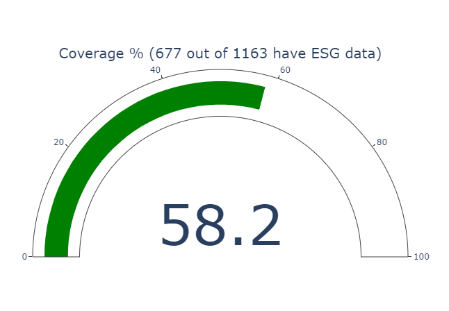

# Find environmental footprint of your bond portfolio

Refinitiv provides the Environment Social and Governance (ESG) data for companies, and with the recent [Fixed income instrument to company ESG data mapping service](https://my.refinitiv.com/content/mytr/en/product-notifications/details.html?id=PCN206511), it is possible to easily map company ESG data to a portfolio of corporate bond instruments. This service provides a mapping between a bond and its *ESGStatementParent* representing the closest related entity to the bond issuer with company ESG.

Company ESG data coverage has increased considerably through both human expertise (more than 650 analysts manually process the ESG universe) and with automation technologies. Today there are more than 13,800+ public and a 1,300+ private companies with detailed reported ESG data that have been carefully processed and standardized. As illustrated below, ESG data is often published at a higher level in the entity hierarchy than the entity that issues the bond, making it challenging for investors to link corporate bond instruments with our company ESG data.



Refinitiv uses consistent rules to derive the most appropriate entity that ESG data can be retrieved from a universe of over **550,000 corporate bonds**. The mappings apply to both public and private companies where ESG data coverage is available, in total this represents more than 15,000 companies. The service is available through the *Bulk files* as well as via a request response *REST* API. Bulk files are available in JSON and CSV formats and include mappings from ISIN, CUSIP SEDOL. Symbology API makes a predefined query format available and supports many common input and output identifiers.


Here are a few examples symbology mapping traversing the hierarchy of parents to find the one with ESG data:

Parent has ESG data:

|            | Name    | Has ESG |
|------------|---------|---------|
| Bond ISIN  | 44654483026        |         |
| Issuer     | SAUDI ELECTRICITY GLOBAL SUKUK COMPANY 3        |         |
| 1st Parent | 4295887339 (Saudi Electricity Company)        |    ✔     |
| Result     | 4295887339        |         |


Second parent has ESG data:

|            | Name    | Has ESG |
|------------|---------|---------|
| Bond ISIN  | 192814833479        |         |
| Issuer     | GOLDMAN SACHS FINANCE CORP INTERNATIONAL LTD        |         |
| 1st Parent | GS Global Markets Inc        |         |
| 2nd Parent | 4295911963 (Goldman Sachs Group Inc)        |    ✔   |
| Result     | 4295911963       |         |


Third parent has ESG data:

|            | Name    | Has ESG |
|------------|---------|---------|
| Bond ISIN  | 192846098875        |         |
| Issuer     | MORGAN STANLEY BANK NA        |         |
| 1st Parent | MORGAN STANLEY DOMESTIC HOLDINGS INC        |         |
| 2nd Parent | Morgan Stanley Capital Management LLC        |         |
| 3rd Parent | 4295904557 (Morgan Stanley)        |    ✔   |
| Result     | 4295904557        |         |


Fourth parent has ESG data:

|            | Name    | Has ESG |
|------------|---------|---------|
| Bond ISIN  | 46641173275        |         |
| Issuer     | PROPERTY AND BUILDING CORP LTD        |         |
| 1st Parent | DISCOUNT INVESTMENT CORP LTD        |         |
| 2nd Parent | DOLPHIN NETHERLANDS BV        |         |
| 3rd Parent | TYRUS SA        |         |
| 4th Parent | 5000620306 (RSA INVERSIONES Y REPRESENTACIONES SA)        |    ✔    |
| Result     | 5000620306        |         |


### API details

There are two methods within the Refinitiv Data Platform (RDP), which provide this Bond -> Parent with ESG symbology mapping. First one is through bulk files distribution and the second one is through the request-response symbology service.

Bulk file features:

    Weekly full universe mapping files
    Map from bond ISIN, CUSIP, SEDOL or PermID
    660K+ bond ISINs have been mapped
    Available in JSON and CSV formats

[User guide for the bulk service](https://developers.refinitiv.com/en/api-catalog/refinitiv-data-platform/refinitiv-data-platform-apis/documentation#fi-instrument-to-esg-mapping-user-guide)

Bulk file example is demonstrated in the [sample usecase](https://github.com/Refinitiv-API-Samples/Example.RDPAPI.Python.BondPortfolioESG) attached with this article.

REST API features:

    Map from bond ISIN, CUSIP, SEDOL or PermID
    Map to PermID or LEI of ESG Parent
	
[User guide for the REST API service](https://developers.refinitiv.com/en/api-catalog/refinitiv-data-platform/refinitiv-data-platform-apis/documentation#discovery-symbology-v-1-api-user-guide)

Request message:
```
POST  https://api.refinitiv.com/discovery/symbology/v1/lookup

{
  "from": [{
      "identifierTypes": [
        "ISIN"
      ],
      "values": [
        "US141784AR94"
      ]
  }],
  "type": "predefined",
  "route": "FindESGStatementParent"
}
```

Response:
```
{
  "data": [{
      "input": [{
          "value": "US141784AR94",
          "identifierType": "ISIN"
      }],
      "output": [{
          "value": "4296555324",
          "identifierType": "PermID",
          "objectType": "Organization",
      }]
  }],
  .
  .
  .
```

### Sample use case
Let us put together an example of how this mapping service can be used to find the ESG score for a portfolio of corporate bonds. Since a portfolio can have thousands of constituents, we will use the bulk file service to download the data set. Once the data is downloaded, it can be used multiple times, without the need for bulky download and parsing every time. The complete Jupyter notebook sample can be downloaded from the [Refinitiv GitHub Samples](https://github.com/Refinitiv-API-Samples/Example.RDPAPI.Python.BondPortfolioESG) repo. Here is a step by step explanation of the notebook:

#### Step 1: Download, parse and save bulk files
For building the database, we need the symbology and the ESG bulk files. The process to download the bulk files is documented in [this tutorial](https://developers.refinitiv.com/en/api-catalog/refinitiv-data-platform/refinitiv-data-platform-apis/tutorials#cfs-subscriber-in-postman-trade-discovery-frtb-example) with examples. The buckets of interest to us are named: *bulk-symbology* and *ESG*. The list of all the file sets in these buckets can be retrieved from the file store URL [/file-store/v1/file-sets?bucket=BUCKET_NAME]().

From within the file-sets, we need the *BondISINSusFinMapping* file for the ISIN to ESG Parent symbology map, and the *ESG Scores* file for the most recent ESG scores for the companies. The Python function *downloadJSONBulkFile*  searches the *file-store* and downloads and un-compresses the named file. We are interested in the file *Init* files, since they contain all the data and not just the deltas.

```
def downloadJSONBulkFile(bucketName, fileAttributes, fileNameKeywords):
  # get a list of all the buckets
  hResp = getRequest('/file-store/v1/file-sets?bucket=' + bucketName + '&pageSize=100&attributes=' + fileAttributes)
  # loop through all the buckets
  for bucket in hResp['value']:
    bName = bucket['name']
    # does bucket contains all the matching keywords
    if all([x in bName for x in fileNameKeywords]):
      fileName = bucket['files'][0]
      print('Found bucket: ', bName, ', FileName: ', fileName)
      # stop any more searching
      break
  ...
```

This download process is repeated for both Symbology and ESG files. After downloading the raw contents of the file are parsed and we save it in a Pandas dataframe in the pickle format for future use. Additional processing is done on the ESG bulk file to keep the most recent fiscal year data, and the rest is discarded.

```
# load the dataset into a pandas dataframe
df2 = pd.DataFrame(scores, columns=['OrganizationId', 'FiscalYear', 'ESGCombinedScore', ... , 'ESGCControversiesScore'])
# keep the latest ESG scores only
df2 = df2.loc[df2.groupby(['OrganizationId'])['FiscalYear'].idxmax()].reset_index(drop=True)
```

This step only has to be performed once. Now, we can continue to use these downloaded files with every portfolio.

#### Step 2: Get the holdings of a bond portfolio
RDP *funds* service endpoint provides the constituents of any Lipper portfolio. For E.g. to request constituents of portfolioID = 60000170, following request is made:

```
GET /data/funds/v1/assets/60000170?properties=holdings

{
  'assets': [{
      'id': '60000170',
      'holdings': [{
          'date': '2023-03-31',
          'securitiesHeldCount': 1174,
          'constituents': [{
              'name': 'UNITED STATES OF AMERICA 6.25% 15-MAY-2030',
              'country': 'UNITED STATES',
              'weight': 4.6235,
              'weightPrevious': 4.5477,
              'weightChange': 0.0758,
              'type': {
                'id': '13737',
                'code': 'SOVEREIGN BOND',
                'name': 'Sovereign Bond'
              },
              'sharesHeld': 747077200.0,
              'sharesPrevious': 747077200.0,
              'sharesChange': 0.0,
              'crossReferenceCodes': [{
                  'code': 'RIC',
                  'type': {
                    'id': '26',
                    'code': 'RIC',
                    'name': 'RIC'
                  },
                  'values': [{
                      'value': '912810FM5='
                    }
                  ]
                }, {
                  'code': 'ISIN',
                  'type': {
                    'id': '1424',
                    'code': 'ISIN',
                    'name': 'ISIN Code'
                  },
                  'values': [{
                      'value': 'US912810FM54'
                    }
                  ]

```
We can iterate the constituents array and extract the ISIN code for every bond holding.

#### Step 3: Lookup the ESG parent for each of the holdings
Next, using our pre-saved Symbology mapping data set, we can lookup the parent corporation of each of the corporate bonds. This is simply performed using the Pandas left join:
```
# create a master dataframe for all processing
mdf = pd.DataFrame(allHoldings, columns =['Bond', 'Weight'])
# merge the ESG parent company info into the holdings dataframe
mdf = mdf.merge(bMapping, how='left', left_on='Bond', right_on='Bond')
```

A graphical Plotly chart can show how many of the holdings have ESG coverage. Note that this portfolio has a number of *Sovereign Bonds* which are issued by the countries and won't have ESG metrics.




#### Step 4: Calculate the consolidated ESG score of the portfolio

As a final step, we can calculate the total ESG score of the whole portfolio. To do this, first we left-join the data sets and then rebase the portfolio, dropping the entries which do not have ESG data and finding the weighted ESG score of the remainder entries.

```
# formulate everything onto a dataframe and display
combined = mdf.merge(scores, how='left', left_on='ESGParent', right_on='OrganizationId')
combined.drop('OrganizationId', axis=1, inplace=True)
```

Apply the holding weight to the holding ESG score:

```
# Rebase, calculate the combined ESG scores of these holdings
weightedSeries = []
for idx, a in combined['ESGCombinedScore'].items():
  if math.isnan(a):
    weightedSeries.append(0)
  else:
    weightedSeries.append(combined['Weight'][idx])

weightTotal = sum(weightedSeries)
rebasedWeight = combined['Weight']/weightTotal
```

This will give us the ESG score for the whole portfolio:

|Bond|Weight|ESGParent|ParentName|FiscalYear|ESGCombinedScore|ESGScore|EnvironmentPillarScore|ESGResourceUseScore|ESGEmissionsScore|ESGInnovationScore|SocialPillarScore|ESGWorkforceScore|ESGHumanRightsScore|ESGCommunityScore|ESGProductResponsibilityScore|GovernancePillarScore|ESGManagementScore|ESGShareholdersScore|ESGCsrStrategyScore|ESGCControversiesScore|
|---|---|---|---|---|---|---|---|---|---|---|---|---|---|---|---|---|---|---|---|---|
|WEIGHTED AVERAGE|1.00|  |  |  |0.53|0.63|0.57|0.61|0.61|0.42|0.64|0.69|0.53|0.74|0.57|0.65|0.68|0.57|0.59|0.68|


I hope this article has been helpful in understanding this new symbology mapping service. The complete Jupyter notebook code shown in this article is available in the [GitHub repo](https://github.com/Refinitiv-API-Samples/Example.RDPAPI.Python.BondPortfolioESG).

